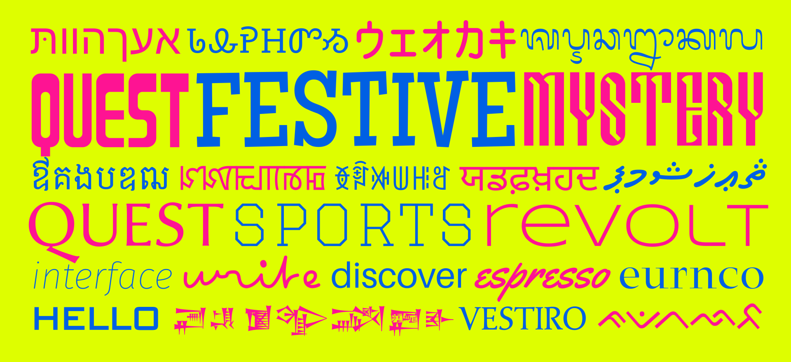

# GetGo Fonts for FontLab

Scratching your head to start a font? [FontLab 8](https://www.fontlab.com/font-editor/fontlab/) gives you a head start. With 99 free template fonts, we’re guiding you from the get-go! GetGo Fonts for FontLab is a carefully curated collection of quality typeface designs available in FontLab’s native VFJ format.

The 99 free designs range from simple Latin sanserif and serif designs, include display and script fonts, and boast several massive multi-axis variable font projects.

But that’s not all! The Zoto fonts (based on the Noto global font collection) give you ready-to-use templates for over 70 writing systems (scripts) from around the world (Cyrillic, Greek, Arabic, emoji, and many others). Those fonts include the right glyph sets and OpenType features. The GetGo collection even bundles a few single-stroke (skeleton) fonts, on which you can experiment with FontLab’s live calligraphic Power Brush.

You may create your own fonts based on these fonts, and you may incorporate portions of these fonts into your own fonts. Each GetGo font is available under one of three licenses: CC-0 (public domain), Apache or OFL. You can download them in the FontLab VFJ format and open them in [FontLab 8](https://www.fontlab.com/font-editor/fontlab/). The collection is growing!

## Download

[Download all fonts](https://github.com/fontlabcom/getgo-fonts/raw/main/getgo-fonts-for-fontlab.zip){: .md-button .md-button--primary }

## Licenses

### CC-0

If the font is licensed under the [CC0 1.0 Universal Public Domain Dedication](https://creativecommons.org/publicdomain/zero/1.0/), it’s dedicated to the public domain. The person who associated a work with this deed has dedicated the work to the public domain by waiving all of his or her rights to the work worldwide under copyright law, including all related and neighboring rights, to the extent allowed by law. You can copy, modify, distribute and perform the work, even for commercial purposes, all without asking permission.

You may create your own fonts based on this font, and you may incorporate portions of this font into your own font. You may publish your own font under any license, including a commercial license, without any limitations.

### Apache

If the font is licensed under the [Apache License v2.0](https://www.apache.org/licenses/LICENSE-2.0.txt):

You may create your own fonts based on this font, and you may incorporate portions of this font into your own font. You may publish your own font under any license, including a commercial license, but you must:

- in _Font Info › Legal › Copyright_, include `Portions Copyright (put the year and the original copyright owner here).`
- in _Font Info › Legal › License_, include `Portions licensed under the Apache License v2.0.`

### OFL

If the font is licensed under the [SIL Open Font License, Version 1.1](https://scripts.sil.org/OFL):

You may create your own fonts based on this font, and you may incorporate portions of this font into your own font, but you must publish the resulting font under the same license (SIL Open Font License, Version 1.1):

- in _Font Info › Legal › Copyright_, include `Portions Copyright (put the year and the original copyright owner here).`
- in _Font Info › Legal › License_, put `Licensed under the SIL Open Font License, Version 1.1.`
- see [the license](https://scripts.sil.org/OFL) for more details

## Fonts

### GG Baar

[Download FontLab VFJ](https://cdn.jsdelivr.net/gh/fontlabcom/getgo-fonts/getgo-fonts/cc0/baar/baar.vfj){: .md-button target="_blank" }

license: CC-0 \| Modular narrow display font \| glyphs: 98 \| scripts: Latin \| [Read more…](baar/)

---

### GG Boto

[Download FontLab VFJ](https://minhaskamal.github.io/DownGit/#/home?url=https://github.com/fontlabcom/getgo-fonts/blob/main/getgo-fonts/apache/boto/boto-var.vfj){: .md-button target="_blank" }

license: Apache \| Grotesque sanserif design with the width, weight and italic axis \| glyphs: 3387 \| scripts: Latin, Cyrillic, Greek \| [Read more…](boto-var/)

---

### GG Cafe

[Download FontLab VFJ](https://cdn.jsdelivr.net/gh/fontlabcom/getgo-fonts/getgo-fonts/apache/cafe/cafe.vfj){: .md-button target="_blank" }

license: Apache \| Signpainter-style flat brush script font \| glyphs: 372 \| scripts: Latin, Greek \| [Read more…](cafe/)

---

### GG Club OFL

[Download FontLab VFJ](https://cdn.jsdelivr.net/gh/fontlabcom/getgo-fonts/getgo-fonts/ofl/club/club-var.vfj){: .md-button target="_blank" }

license: OFL \| Variable font with 12 axes in college block style \| glyphs: 563 \| scripts: Latin, Greek \| [Read more…](club-var/)

---

### GG Cosm Italic

[Download FontLab VFJ](https://cdn.jsdelivr.net/gh/fontlabcom/getgo-fonts/getgo-fonts/cc0/cosm/cosm-italic-var.vfj){: .md-button target="_blank" }

license: CC-0 \| Neo-grotesque sanserif font family with a weight axis, italic version \| glyphs: 340 \| scripts: Latin \| [Read more…](cosm-italic-var/)

---

### GG Cosm

[Download FontLab VFJ](https://cdn.jsdelivr.net/gh/fontlabcom/getgo-fonts/getgo-fonts/cc0/cosm/cosm-var.vfj){: .md-button target="_blank" }

license: CC-0 \| Neo-grotesque sanserif font family with a weight axis, upright version \| glyphs: 359 \| scripts: Latin \| [Read more…](cosm-var/)

---

### GG Deco

[Download FontLab VFJ](https://cdn.jsdelivr.net/gh/fontlabcom/getgo-fonts/getgo-fonts/cc0/deco/deco.vfj){: .md-button target="_blank" }

license: CC-0 \| Geometric art deco sanserif font \| glyphs: 104 \| scripts: Latin \| [Read more…](deco/)

---

### GG Fest

[Download FontLab VFJ](https://cdn.jsdelivr.net/gh/fontlabcom/getgo-fonts/getgo-fonts/apache/fest/fest.vfj){: .md-button target="_blank" }

license: Apache \| Festive slab serif font inspired by 1950s hand lettering \| glyphs: 369 \| scripts: Latin \| [Read more…](fest/)

---

### GG Hint

[Download FontLab VFJ](https://cdn.jsdelivr.net/gh/fontlabcom/getgo-fonts/getgo-fonts/apache/hint/hint.vfj){: .md-button target="_blank" }

license: Apache \| Unicase sanserif design with pixel-perfect manual TrueType Hinting (TTH) \| glyphs: 372 \| scripts: Latin, Greek \| [Read more…](hint/)

---

### GG Medi

[Download FontLab VFJ](https://cdn.jsdelivr.net/gh/fontlabcom/getgo-fonts/getgo-fonts/cc0/medi/medi.vfj){: .md-button target="_blank" }

license: CC-0 \| Didone serif font \| glyphs: 103 \| scripts: Latin \| [Read more…](medi/)

---

### GG Ocra

[Download FontLab VFJ](https://cdn.jsdelivr.net/gh/fontlabcom/getgo-fonts/getgo-fonts/cc0/ocra/ocra.vfj){: .md-button target="_blank" }

license: CC-0 \| Simple OCR-A (Latin) and OCR-BK (Japanese) font \| glyphs: 177 \| scripts: Latin, Katakana \| [Read more…](ocra/)

---

### GG Pixa

[Download FontLab VFJ](https://minhaskamal.github.io/DownGit/#/home?url=https://github.com/fontlabcom/getgo-fonts/blob/main/getgo-fonts/cc0/pixa/pixa.vfj){: .md-button target="_blank" }

license: CC-0 \| Quirky pixel font with 14 pixels tall letters, for 28 writing systems \| glyphs: 14769 \| scripts: Han, Hangul, Latin, Canadian Aboriginal, Greek, Cyrillic, Arabic, Katakana, Myanmar, Coptic, Devanagari, Cherokee, Armenian, Hiragana, Hebrew, Runic, Bengali, Syriac, Thai, Braille, Tamil, Tifinagh, Nko, Thaana, Tibetan, Ogham, Bopomofo, Malayalam \| [Read more…](pixa/)

---

### GG Plum

[Download FontLab VFJ](https://cdn.jsdelivr.net/gh/fontlabcom/getgo-fonts/getgo-fonts/cc0/plum/plum-var.vfj){: .md-button target="_blank" }

license: CC-0 \| Humanist sanserif font family with a weight axis \| glyphs: 205 \| scripts: Latin \| [Read more…](plum-var/)

---

### GG Ptit OFL

[Download FontLab VFJ](https://cdn.jsdelivr.net/gh/fontlabcom/getgo-fonts/getgo-fonts/ofl/ptit/ptit.vfj){: .md-button target="_blank" }

license: OFL \| Multi-script handwritten font that uses single stroke \| glyphs: 4760 \| scripts: Latin, Greek, Cyrillic, Katakana, Cherokee \| [Read more…](ptit/)

---

### GG Rafi OFL Italic

[Download FontLab VFJ](https://cdn.jsdelivr.net/gh/fontlabcom/getgo-fonts/getgo-fonts/ofl/rafi/rafi-italic-var.vfj){: .md-button target="_blank" }

license: OFL \| Legible sanserif for UIs and signage with a weight axis, italic version \| glyphs: 854 \| scripts: Latin, Greek \| [Read more…](rafi-italic-var/)

---

### GG Rafi OFL

[Download FontLab VFJ](https://cdn.jsdelivr.net/gh/fontlabcom/getgo-fonts/getgo-fonts/ofl/rafi/rafi-var.vfj){: .md-button target="_blank" }

license: OFL \| Legible sanserif for UIs and signage with a weight axis, italic version \| glyphs: 855 \| scripts: Latin, Greek \| [Read more…](rafi-var/)

---

### GG Scig OFL Regular

[Download FontLab VFJ](https://minhaskamal.github.io/DownGit/#/home?url=https://github.com/fontlabcom/getgo-fonts/blob/main/getgo-fonts/ofl/scig/scig-var.vfj){: .md-button target="_blank" }

license: OFL \| Rectangular sanserif design with weight, width, slant and contrast axes \| glyphs: 1218 \| scripts: Latin, Cyrillic \| [Read more…](scig-var/)

---

### GG Star

[Download FontLab VFJ](https://cdn.jsdelivr.net/gh/fontlabcom/getgo-fonts/getgo-fonts/cc0/star/star.vfj){: .md-button target="_blank" }

license: CC-0 \| Narrow retro sci-fi display font \| glyphs: 144 \| scripts: Cyrillic, Latin \| [Read more…](star/)

---

### GG Stroke Chan OFL Italic

[Download FontLab VFJ](https://cdn.jsdelivr.net/gh/fontlabcom/getgo-fonts/getgo-fonts/ofl/stroke-chan/stroke-chan.vfj){: .md-button target="_blank" }

license: OFL \| Single-stroke italic design in chancery style, for use with Power Brush or Stroke \| glyphs: 106 \| scripts: Latin \| [Read more…](stroke-chan/)

---

### GG Stroke Grot OFL

[Download FontLab VFJ](https://cdn.jsdelivr.net/gh/fontlabcom/getgo-fonts/getgo-fonts/ofl/stroke-grot/stroke-grot.vfj){: .md-button target="_blank" }

license: OFL \| Single-stroke grotesque sanserif design, for use with Power Brush or Stroke \| glyphs: 132 \| scripts: Latin \| [Read more…](stroke-grot/)

---

### GG Veni

[Download FontLab VFJ](https://cdn.jsdelivr.net/gh/fontlabcom/getgo-fonts/getgo-fonts/cc0/veni/veni.vfj){: .md-button target="_blank" }

license: CC-0 \| Renaissance serif font \| glyphs: 199 \| scripts: Latin \| [Read more…](veni/)

---

### GG Vize

[Download FontLab VFJ](https://cdn.jsdelivr.net/gh/fontlabcom/getgo-fonts/getgo-fonts/cc0/vize/vize.vfj){: .md-button target="_blank" }

license: CC-0 \| Renaissance humanist sanserif font \| glyphs: 103 \| scripts: Latin \| [Read more…](vize/)

---

### Zoto Emoji

[Download FontLab VFJ](https://cdn.jsdelivr.net/gh/fontlabcom/getgo-fonts/getgo-fonts/apache/zotoemoji/zoto-emoji.vfj){: .md-button target="_blank" }

license: Apache \| Reference font for Emoji symbols \| glyphs: 771 \| scripts:  \| [Read more…](zoto-emoji/)

---

### Zoto Kufi Arabic

[Download FontLab VFJ](https://cdn.jsdelivr.net/gh/fontlabcom/getgo-fonts/getgo-fonts/apache/zotosans/zoto-kufiarabic.vfj){: .md-button target="_blank" }

license: Apache \| Reference font for the Arabic script in the Kufi style \| glyphs: 762 \| scripts: Arabic \| [Read more…](zoto-kufiarabic/)

---

### Zoto Sans Armenian

[Download FontLab VFJ](https://cdn.jsdelivr.net/gh/fontlabcom/getgo-fonts/getgo-fonts/apache/zotosans/zotosans-armenian.vfj){: .md-button target="_blank" }

license: Apache \| Reference sans font for the Armenian script \| glyphs: 98 \| scripts: Armenian \| [Read more…](zotosans-armenian/)

---

### Zoto Sans Avestan

[Download FontLab VFJ](https://cdn.jsdelivr.net/gh/fontlabcom/getgo-fonts/getgo-fonts/apache/zotosans/zotosans-avestan.vfj){: .md-button target="_blank" }

license: Apache \| Reference sans font for the Avestan script \| glyphs: 73 \| scripts: Avestan \| [Read more…](zotosans-avestan/)

---

### Zoto Sans Balinese

[Download FontLab VFJ](https://cdn.jsdelivr.net/gh/fontlabcom/getgo-fonts/getgo-fonts/apache/zotosans/zotosans-balinese.vfj){: .md-button target="_blank" }

license: Apache \| Reference sans font for the Balinese script \| glyphs: 182 \| scripts: Balinese \| [Read more…](zotosans-balinese/)

---

### Zoto Sans Bamum

[Download FontLab VFJ](https://cdn.jsdelivr.net/gh/fontlabcom/getgo-fonts/getgo-fonts/apache/zotosans/zotosans-bamum.vfj){: .md-button target="_blank" }

license: Apache \| Reference sans font for the Bamum script \| glyphs: 661 \| scripts: Bamum \| [Read more…](zotosans-bamum/)

---

### Zoto Sans Batak

[Download FontLab VFJ](https://cdn.jsdelivr.net/gh/fontlabcom/getgo-fonts/getgo-fonts/apache/zotosans/zotosans-batak.vfj){: .md-button target="_blank" }

license: Apache \| Reference sans font for the Batak script \| glyphs: 61 \| scripts: Batak \| [Read more…](zotosans-batak/)

---

### Zoto Sans Brahmi

[Download FontLab VFJ](https://cdn.jsdelivr.net/gh/fontlabcom/getgo-fonts/getgo-fonts/apache/zotosans/zotosans-brahmi.vfj){: .md-button target="_blank" }

license: Apache \| Reference sans font for the Brahmi script \| glyphs: 182 \| scripts: Brahmi \| [Read more…](zotosans-brahmi/)

---

### Zoto Sans Buginese

[Download FontLab VFJ](https://cdn.jsdelivr.net/gh/fontlabcom/getgo-fonts/getgo-fonts/apache/zotosans/zotosans-buginese.vfj){: .md-button target="_blank" }

license: Apache \| Reference sans font for the Buginese script \| glyphs: 63 \| scripts: Buginese \| [Read more…](zotosans-buginese/)

---

### Zoto Sans Buhid

[Download FontLab VFJ](https://cdn.jsdelivr.net/gh/fontlabcom/getgo-fonts/getgo-fonts/apache/zotosans/zotosans-buhid.vfj){: .md-button target="_blank" }

license: Apache \| Reference sans font for the Buhid script \| glyphs: 39 \| scripts: Buhid \| [Read more…](zotosans-buhid/)

---

### Zoto Sans Canadian Aboriginal

[Download FontLab VFJ](https://cdn.jsdelivr.net/gh/fontlabcom/getgo-fonts/getgo-fonts/apache/zotosans/zotosans-canadianaboriginal.vfj){: .md-button target="_blank" }

license: Apache \| Reference sans font for the Canadian Aboriginal syllabics \| glyphs: 744 \| scripts: Canadian Aboriginal, Latin \| [Read more…](zotosans-canadianaboriginal/)

---

### Zoto Sans Carian

[Download FontLab VFJ](https://cdn.jsdelivr.net/gh/fontlabcom/getgo-fonts/getgo-fonts/apache/zotosans/zotosans-carian.vfj){: .md-button target="_blank" }

license: Apache \| Reference sans font for the Carian script \| glyphs: 53 \| scripts: Carian \| [Read more…](zotosans-carian/)

---

### Zoto Sans Cham

[Download FontLab VFJ](https://cdn.jsdelivr.net/gh/fontlabcom/getgo-fonts/getgo-fonts/apache/zotosans/zotosans-cham.vfj){: .md-button target="_blank" }

license: Apache \| Reference sans font for the Cham script \| glyphs: 127 \| scripts: Cham \| [Read more…](zotosans-cham/)

---

### Zoto Sans Cherokee

[Download FontLab VFJ](https://cdn.jsdelivr.net/gh/fontlabcom/getgo-fonts/getgo-fonts/apache/zotosans/zotosans-cherokee.vfj){: .md-button target="_blank" }

license: Apache \| Reference sans font for the Cherokee script \| glyphs: 89 \| scripts: Cherokee \| [Read more…](zotosans-cherokee/)

---

### Zoto Sans Coptic

[Download FontLab VFJ](https://cdn.jsdelivr.net/gh/fontlabcom/getgo-fonts/getgo-fonts/apache/zotosans/zotosans-coptic.vfj){: .md-button target="_blank" }

license: Apache \| Reference sans font for the Coptic script \| glyphs: 190 \| scripts: Coptic, Latin \| [Read more…](zotosans-coptic/)

---

### Zoto Sans Cuneiform

[Download FontLab VFJ](https://cdn.jsdelivr.net/gh/fontlabcom/getgo-fonts/getgo-fonts/apache/zotosans/zotosans-cuneiform.vfj){: .md-button target="_blank" }

license: Apache \| Reference sans font for the Cuneiform script \| glyphs: 986 \| scripts: Cuneiform \| [Read more…](zotosans-cuneiform/)

---

### Zoto Sans Cypriot

[Download FontLab VFJ](https://cdn.jsdelivr.net/gh/fontlabcom/getgo-fonts/getgo-fonts/apache/zotosans/zotosans-cypriot.vfj){: .md-button target="_blank" }

license: Apache \| Reference sans font for the Cypriot script \| glyphs: 59 \| scripts: Cypriot \| [Read more…](zotosans-cypriot/)

---

### Zoto Sans Deseret

[Download FontLab VFJ](https://cdn.jsdelivr.net/gh/fontlabcom/getgo-fonts/getgo-fonts/apache/zotosans/zotosans-deseret.vfj){: .md-button target="_blank" }

license: Apache \| Reference sans font for the Deseret script \| glyphs: 84 \| scripts: Deseret \| [Read more…](zotosans-deseret/)

---

### Zoto Sans Egyptian Hieroglyphs

[Download FontLab VFJ](https://cdn.jsdelivr.net/gh/fontlabcom/getgo-fonts/getgo-fonts/apache/zotosans/zotosans-egyptianhieroglyphs.vfj){: .md-button target="_blank" }

license: Apache \| Reference sans font for the Egyptian Hieroglyphs script \| glyphs: 1075 \| scripts: Egyptian Hieroglyphs \| [Read more…](zotosans-egyptianhieroglyphs/)

---

### Zoto Sans Ethiopic

[Download FontLab VFJ](https://cdn.jsdelivr.net/gh/fontlabcom/getgo-fonts/getgo-fonts/apache/zotosans/zotosans-ethiopic.vfj){: .md-button target="_blank" }

license: Apache \| Reference sans font for the Ethiopic script \| glyphs: 559 \| scripts: Ethiopic \| [Read more…](zotosans-ethiopic/)

---

### Zoto Sans Georgian

[Download FontLab VFJ](https://cdn.jsdelivr.net/gh/fontlabcom/getgo-fonts/getgo-fonts/apache/zotosans/zotosans-georgian.vfj){: .md-button target="_blank" }

license: Apache \| Reference sans font for the Georgian script \| glyphs: 127 \| scripts: Georgian, Armenian \| [Read more…](zotosans-georgian/)

---

### Zoto Sans Glagolitic

[Download FontLab VFJ](https://cdn.jsdelivr.net/gh/fontlabcom/getgo-fonts/getgo-fonts/apache/zotosans/zotosans-glagolitic.vfj){: .md-button target="_blank" }

license: Apache \| Reference sans font for the Glagolitic script \| glyphs: 98 \| scripts: Glagolitic \| [Read more…](zotosans-glagolitic/)

---

### Zoto Sans Gothic

[Download FontLab VFJ](https://cdn.jsdelivr.net/gh/fontlabcom/getgo-fonts/getgo-fonts/apache/zotosans/zotosans-gothic.vfj){: .md-button target="_blank" }

license: Apache \| Reference sans font for the Gothic script \| glyphs: 43 \| scripts: Gothic \| [Read more…](zotosans-gothic/)

---

### Zoto Sans Gurmukhi

[Download FontLab VFJ](https://cdn.jsdelivr.net/gh/fontlabcom/getgo-fonts/getgo-fonts/apache/zotosans/zotosans-gurmukhi.vfj){: .md-button target="_blank" }

license: Apache \| Reference sans font for the Gurmukhi script \| glyphs: 301 \| scripts: Gurmukhi \| [Read more…](zotosans-gurmukhi/)

---

### Zoto Sans Hanunoo

[Download FontLab VFJ](https://cdn.jsdelivr.net/gh/fontlabcom/getgo-fonts/getgo-fonts/apache/zotosans/zotosans-hanunoo.vfj){: .md-button target="_blank" }

license: Apache \| Reference sans font for the Hanunoo script \| glyphs: 43 \| scripts: Hanunoo \| [Read more…](zotosans-hanunoo/)

---

### Zoto Sans Hebrew

[Download FontLab VFJ](https://cdn.jsdelivr.net/gh/fontlabcom/getgo-fonts/getgo-fonts/apache/zotosans/zotosans-hebrew.vfj){: .md-button target="_blank" }

license: Apache \| Reference sans font for the Hebrew script \| glyphs: 155 \| scripts: Hebrew \| [Read more…](zotosans-hebrew/)

---

### Zoto Sans Historic

[Download FontLab VFJ](https://cdn.jsdelivr.net/gh/fontlabcom/getgo-fonts/getgo-fonts/apache/zotosans/zotosans-historic.vfj){: .md-button target="_blank" }

license: Apache \| Reference sans font for several historic scripts \| glyphs: 3638 \| scripts: Egyptian Hieroglyphs, Cuneiform, Linear B, Latin, Old Turkic, Samaritan, Avestan, Phags Pa, Carian, Old Persian, Ugaritic, Osmanya, Old South Arabian, Mandaic, Lycian, Lydian, Imperial Aramaic, Phoenician, Inscriptional Parthian, Inscriptional Pahlavi \| [Read more…](zotosans-historic/)

---

### Zoto Sans Imperial Aramaic

[Download FontLab VFJ](https://cdn.jsdelivr.net/gh/fontlabcom/getgo-fonts/getgo-fonts/apache/zotosans/zotosans-imperialaramaic.vfj){: .md-button target="_blank" }

license: Apache \| Reference sans font for the Imperial Aramaic script \| glyphs: 35 \| scripts: Imperial Aramaic \| [Read more…](zotosans-imperialaramaic/)

---

### Zoto Sans Inscriptional Pahlavi

[Download FontLab VFJ](https://cdn.jsdelivr.net/gh/fontlabcom/getgo-fonts/getgo-fonts/apache/zotosans/zotosans-inscriptionalpahlavi.vfj){: .md-button target="_blank" }

license: Apache \| Reference sans font for the Inscriptional Pahlavi script \| glyphs: 34 \| scripts: Inscriptional Pahlavi \| [Read more…](zotosans-inscriptionalpahlavi/)

---

### Zoto Sans Inscriptional Parthian

[Download FontLab VFJ](https://cdn.jsdelivr.net/gh/fontlabcom/getgo-fonts/getgo-fonts/apache/zotosans/zotosans-inscriptionalparthian.vfj){: .md-button target="_blank" }

license: Apache \| Reference sans font for the Inscriptional Parthian script \| glyphs: 45 \| scripts: Inscriptional Parthian \| [Read more…](zotosans-inscriptionalparthian/)

---

### Zoto Sans Javanese

[Download FontLab VFJ](https://cdn.jsdelivr.net/gh/fontlabcom/getgo-fonts/getgo-fonts/apache/zotosans/zotosans-javanese.vfj){: .md-button target="_blank" }

license: Apache \| Reference sans font for the Javanese script \| glyphs: 155 \| scripts: Javanese \| [Read more…](zotosans-javanese/)

---

### Zoto Sans Kayah Li

[Download FontLab VFJ](https://cdn.jsdelivr.net/gh/fontlabcom/getgo-fonts/getgo-fonts/apache/zotosans/zotosans-kayahli.vfj){: .md-button target="_blank" }

license: Apache \| Reference sans font for the Kayah Li script \| glyphs: 54 \| scripts: Kayah Li \| [Read more…](zotosans-kayahli/)

---

### Zoto Sans Kharoshthi

[Download FontLab VFJ](https://cdn.jsdelivr.net/gh/fontlabcom/getgo-fonts/getgo-fonts/apache/zotosans/zotosans-kharoshthi.vfj){: .md-button target="_blank" }

license: Apache \| Reference sans font for the Kharoshthi script \| glyphs: 133 \| scripts: Kharoshthi \| [Read more…](zotosans-kharoshthi/)

---

### Zoto Sans Khmer

[Download FontLab VFJ](https://cdn.jsdelivr.net/gh/fontlabcom/getgo-fonts/getgo-fonts/apache/zotosans/zotosans-khmer.vfj){: .md-button target="_blank" }

license: Apache \| Reference sans font for the Khmer script \| glyphs: 265 \| scripts: Khmer \| [Read more…](zotosans-khmer/)

---

### Zoto Sans Lao

[Download FontLab VFJ](https://cdn.jsdelivr.net/gh/fontlabcom/getgo-fonts/getgo-fonts/apache/zotosans/zotosans-lao.vfj){: .md-button target="_blank" }

license: Apache \| Reference sans font for the Lao script \| glyphs: 166 \| scripts: Lao \| [Read more…](zotosans-lao/)

---

### Zoto Sans Limbu

[Download FontLab VFJ](https://cdn.jsdelivr.net/gh/fontlabcom/getgo-fonts/getgo-fonts/apache/zotosans/zotosans-limbu.vfj){: .md-button target="_blank" }

license: Apache \| Reference sans font for the Limbu script \| glyphs: 73 \| scripts: Limbu \| [Read more…](zotosans-limbu/)

---

### Zoto Sans Linear B

[Download FontLab VFJ](https://cdn.jsdelivr.net/gh/fontlabcom/getgo-fonts/getgo-fonts/apache/zotosans/zotosans-linearb.vfj){: .md-button target="_blank" }

license: Apache \| Reference sans font for the Linear B script \| glyphs: 272 \| scripts: Linear B \| [Read more…](zotosans-linearb/)

---

### Zoto Sans Lisu

[Download FontLab VFJ](https://cdn.jsdelivr.net/gh/fontlabcom/getgo-fonts/getgo-fonts/apache/zotosans/zotosans-lisu.vfj){: .md-button target="_blank" }

license: Apache \| Reference sans font for the Lisu script \| glyphs: 54 \| scripts: Lisu \| [Read more…](zotosans-lisu/)

---

### Zoto Sans Lycian

[Download FontLab VFJ](https://cdn.jsdelivr.net/gh/fontlabcom/getgo-fonts/getgo-fonts/apache/zotosans/zotosans-lycian.vfj){: .md-button target="_blank" }

license: Apache \| Reference sans font for the Lycian script \| glyphs: 33 \| scripts: Lycian \| [Read more…](zotosans-lycian/)

---

### Zoto Sans Lydian

[Download FontLab VFJ](https://cdn.jsdelivr.net/gh/fontlabcom/getgo-fonts/getgo-fonts/apache/zotosans/zotosans-lydian.vfj){: .md-button target="_blank" }

license: Apache \| Reference sans font for the Lydian script \| glyphs: 31 \| scripts: Lydian \| [Read more…](zotosans-lydian/)

---

### Zoto Sans Mandaic

[Download FontLab VFJ](https://cdn.jsdelivr.net/gh/fontlabcom/getgo-fonts/getgo-fonts/apache/zotosans/zotosans-mandaic.vfj){: .md-button target="_blank" }

license: Apache \| Reference sans font for the Mandaic script \| glyphs: 128 \| scripts: Mandaic \| [Read more…](zotosans-mandaic/)

---

### Zoto Sans Meetei Mayek

[Download FontLab VFJ](https://cdn.jsdelivr.net/gh/fontlabcom/getgo-fonts/getgo-fonts/apache/zotosans/zotosans-meeteimayek.vfj){: .md-button target="_blank" }

license: Apache \| Reference sans font for the Meetei Mayek script \| glyphs: 91 \| scripts: Meetei Mayek \| [Read more…](zotosans-meeteimayek/)

---

### Zoto Sans Mongolian

[Download FontLab VFJ](https://cdn.jsdelivr.net/gh/fontlabcom/getgo-fonts/getgo-fonts/apache/zotosans/zotosans-mongolian.vfj){: .md-button target="_blank" }

license: Apache \| Reference sans font for the Mongolian script \| glyphs: 1511 \| scripts: Mongolian \| [Read more…](zotosans-mongolian/)

---

### Zoto Sans New Tai Lue

[Download FontLab VFJ](https://cdn.jsdelivr.net/gh/fontlabcom/getgo-fonts/getgo-fonts/apache/zotosans/zotosans-newtailue.vfj){: .md-button target="_blank" }

license: Apache \| Reference sans font for the New Tai Lue script \| glyphs: 91 \| scripts: New Tai Lue \| [Read more…](zotosans-newtailue/)

---

### Zoto Sans NKo

[Download FontLab VFJ](https://cdn.jsdelivr.net/gh/fontlabcom/getgo-fonts/getgo-fonts/apache/zotosans/zotosans-nko.vfj){: .md-button target="_blank" }

license: Apache \| Reference sans font for the Nko script \| glyphs: 174 \| scripts: Nko, Arabic \| [Read more…](zotosans-nko/)

---

### Zoto Sans Ogham

[Download FontLab VFJ](https://cdn.jsdelivr.net/gh/fontlabcom/getgo-fonts/getgo-fonts/apache/zotosans/zotosans-ogham.vfj){: .md-button target="_blank" }

license: Apache \| Reference sans font for the Ogham script \| glyphs: 33 \| scripts: Ogham \| [Read more…](zotosans-ogham/)

---

### Zoto Sans Ol Chiki

[Download FontLab VFJ](https://cdn.jsdelivr.net/gh/fontlabcom/getgo-fonts/getgo-fonts/apache/zotosans/zotosans-olchiki.vfj){: .md-button target="_blank" }

license: Apache \| Reference sans font for the Ol Chiki script \| glyphs: 52 \| scripts: Ol Chiki \| [Read more…](zotosans-olchiki/)

---

### Zoto Sans Old Italic

[Download FontLab VFJ](https://cdn.jsdelivr.net/gh/fontlabcom/getgo-fonts/getgo-fonts/apache/zotosans/zotosans-olditalic.vfj){: .md-button target="_blank" }

license: Apache \| Reference sans font for the Old Italic script \| glyphs: 39 \| scripts: Old Italic \| [Read more…](zotosans-olditalic/)

---

### Zoto Sans Old Persian

[Download FontLab VFJ](https://cdn.jsdelivr.net/gh/fontlabcom/getgo-fonts/getgo-fonts/apache/zotosans/zotosans-oldpersian.vfj){: .md-button target="_blank" }

license: Apache \| Reference sans font for the Old Persian script \| glyphs: 54 \| scripts: Old Persian \| [Read more…](zotosans-oldpersian/)

---

### Zoto Sans Old South Arabian

[Download FontLab VFJ](https://cdn.jsdelivr.net/gh/fontlabcom/getgo-fonts/getgo-fonts/apache/zotosans/zotosans-oldsoutharabian.vfj){: .md-button target="_blank" }

license: Apache \| Reference sans font for the Old South Arabian script \| glyphs: 36 \| scripts: Old South Arabian \| [Read more…](zotosans-oldsoutharabian/)

---

### Zoto Sans Old Turkic

[Download FontLab VFJ](https://cdn.jsdelivr.net/gh/fontlabcom/getgo-fonts/getgo-fonts/apache/zotosans/zotosans-oldturkic.vfj){: .md-button target="_blank" }

license: Apache \| Reference sans font for the Old Turkic script \| glyphs: 77 \| scripts: Old Turkic \| [Read more…](zotosans-oldturkic/)

---

### Zoto Sans Osmanya

[Download FontLab VFJ](https://cdn.jsdelivr.net/gh/fontlabcom/getgo-fonts/getgo-fonts/apache/zotosans/zotosans-osmanya.vfj){: .md-button target="_blank" }

license: Apache \| Reference sans font for the Osmanya script \| glyphs: 44 \| scripts: Osmanya \| [Read more…](zotosans-osmanya/)

---

### Zoto Sans Phags Pa

[Download FontLab VFJ](https://cdn.jsdelivr.net/gh/fontlabcom/getgo-fonts/getgo-fonts/apache/zotosans/zotosans-phagspa.vfj){: .md-button target="_blank" }

license: Apache \| Reference sans font for the Phags-pa script \| glyphs: 382 \| scripts: Phags Pa, Mongolian \| [Read more…](zotosans-phagspa/)

---

### Zoto Sans Phoenician

[Download FontLab VFJ](https://cdn.jsdelivr.net/gh/fontlabcom/getgo-fonts/getgo-fonts/apache/zotosans/zotosans-phoenician.vfj){: .md-button target="_blank" }

license: Apache \| Reference sans font for the Phoenician script \| glyphs: 33 \| scripts: Phoenician \| [Read more…](zotosans-phoenician/)

---

### Zoto Sans Rejang

[Download FontLab VFJ](https://cdn.jsdelivr.net/gh/fontlabcom/getgo-fonts/getgo-fonts/apache/zotosans/zotosans-rejang.vfj){: .md-button target="_blank" }

license: Apache \| Reference sans font for the Rejang script \| glyphs: 41 \| scripts: Rejang \| [Read more…](zotosans-rejang/)

---

### Zoto Sans Runic

[Download FontLab VFJ](https://cdn.jsdelivr.net/gh/fontlabcom/getgo-fonts/getgo-fonts/apache/zotosans/zotosans-runic.vfj){: .md-button target="_blank" }

license: Apache \| Reference sans font for the Runic script \| glyphs: 85 \| scripts: Runic \| [Read more…](zotosans-runic/)

---

### Zoto Sans Samaritan

[Download FontLab VFJ](https://cdn.jsdelivr.net/gh/fontlabcom/getgo-fonts/getgo-fonts/apache/zotosans/zotosans-samaritan.vfj){: .md-button target="_blank" }

license: Apache \| Reference sans font for the Samaritan script \| glyphs: 67 \| scripts: Samaritan \| [Read more…](zotosans-samaritan/)

---

### Zoto Sans Saurashtra

[Download FontLab VFJ](https://cdn.jsdelivr.net/gh/fontlabcom/getgo-fonts/getgo-fonts/apache/zotosans/zotosans-saurashtra.vfj){: .md-button target="_blank" }

license: Apache \| Reference sans font for the Saurasthra script \| glyphs: 93 \| scripts: Saurashtra \| [Read more…](zotosans-saurashtra/)

---

### Zoto Sans Shavian

[Download FontLab VFJ](https://cdn.jsdelivr.net/gh/fontlabcom/getgo-fonts/getgo-fonts/apache/zotosans/zotosans-shavian.vfj){: .md-button target="_blank" }

license: Apache \| Reference sans font for the Shavian script \| glyphs: 52 \| scripts: Shavian \| [Read more…](zotosans-shavian/)

---

### Zoto Sans Sundanese

[Download FontLab VFJ](https://cdn.jsdelivr.net/gh/fontlabcom/getgo-fonts/getgo-fonts/apache/zotosans/zotosans-sundanese.vfj){: .md-button target="_blank" }

license: Apache \| Reference sans font for the Sundanese script \| glyphs: 79 \| scripts: Sundanese \| [Read more…](zotosans-sundanese/)

---

### Zoto Sans Syloti Nagri

[Download FontLab VFJ](https://cdn.jsdelivr.net/gh/fontlabcom/getgo-fonts/getgo-fonts/apache/zotosans/zotosans-sylotinagri.vfj){: .md-button target="_blank" }

license: Apache \| Reference sans font for the Syloti Nagri script \| glyphs: 85 \| scripts: Syloti Nagri \| [Read more…](zotosans-sylotinagri/)

---

### Zoto Sans Symbols

[Download FontLab VFJ](https://cdn.jsdelivr.net/gh/fontlabcom/getgo-fonts/getgo-fonts/apache/zotosans/zotosans-symbols.vfj){: .md-button target="_blank" }

license: Apache \| Reference symbol font \| glyphs: 5126 \| scripts: Braille, Greek \| [Read more…](zotosans-symbols/)

---

### Zoto Sans Tagalog

[Download FontLab VFJ](https://cdn.jsdelivr.net/gh/fontlabcom/getgo-fonts/getgo-fonts/apache/zotosans/zotosans-tagalog.vfj){: .md-button target="_blank" }

license: Apache \| Reference sans font for the Tagalog script \| glyphs: 26 \| scripts: Tagalog \| [Read more…](zotosans-tagalog/)

---

### Zoto Sans Tagbanwa

[Download FontLab VFJ](https://cdn.jsdelivr.net/gh/fontlabcom/getgo-fonts/getgo-fonts/apache/zotosans/zotosans-tagbanwa.vfj){: .md-button target="_blank" }

license: Apache \| Reference sans font for the Tagbanwa script \| glyphs: 24 \| scripts: Tagbanwa \| [Read more…](zotosans-tagbanwa/)

---

### Zoto Sans Tai Le

[Download FontLab VFJ](https://cdn.jsdelivr.net/gh/fontlabcom/getgo-fonts/getgo-fonts/apache/zotosans/zotosans-taile.vfj){: .md-button target="_blank" }

license: Apache \| Reference sans font for the Tai Le script \| glyphs: 55 \| scripts: Tai Le \| [Read more…](zotosans-taile/)

---

### Zoto Sans Tai Tham

[Download FontLab VFJ](https://cdn.jsdelivr.net/gh/fontlabcom/getgo-fonts/getgo-fonts/apache/zotosans/zotosans-taitham.vfj){: .md-button target="_blank" }

license: Apache \| Reference sans font for the Tai Tham script \| glyphs: 231 \| scripts: Tai Tham \| [Read more…](zotosans-taitham/)

---

### Zoto Sans Tai Viet

[Download FontLab VFJ](https://cdn.jsdelivr.net/gh/fontlabcom/getgo-fonts/getgo-fonts/apache/zotosans/zotosans-taiviet.vfj){: .md-button target="_blank" }

license: Apache \| Reference sans font for the Tai Viet script \| glyphs: 81 \| scripts: Tai Viet, Latin \| [Read more…](zotosans-taiviet/)

---

### Zoto Sans Tamil

[Download FontLab VFJ](https://cdn.jsdelivr.net/gh/fontlabcom/getgo-fonts/getgo-fonts/apache/zotosans/zotosans-tamil.vfj){: .md-button target="_blank" }

license: Apache \| Reference sans font for the Tamil script \| glyphs: 215 \| scripts: Tamil \| [Read more…](zotosans-tamil/)

---

### Zoto Sans Thaana

[Download FontLab VFJ](https://cdn.jsdelivr.net/gh/fontlabcom/getgo-fonts/getgo-fonts/apache/zotosans/zotosans-thaana.vfj){: .md-button target="_blank" }

license: Apache \| Reference sans font for the Thaana script \| glyphs: 95 \| scripts: Thaana, Arabic \| [Read more…](zotosans-thaana/)

---

### Zoto Sans Tifinagh

[Download FontLab VFJ](https://cdn.jsdelivr.net/gh/fontlabcom/getgo-fonts/getgo-fonts/apache/zotosans/zotosans-tifinagh.vfj){: .md-button target="_blank" }

license: Apache \| Reference sans font for the Tifinagh script \| glyphs: 101 \| scripts: Tifinagh \| [Read more…](zotosans-tifinagh/)

---

### Zoto Sans Ugaritic

[Download FontLab VFJ](https://cdn.jsdelivr.net/gh/fontlabcom/getgo-fonts/getgo-fonts/apache/zotosans/zotosans-ugaritic.vfj){: .md-button target="_blank" }

license: Apache \| Reference sans font for the Ugaritic script \| glyphs: 35 \| scripts: Ugaritic \| [Read more…](zotosans-ugaritic/)

---

### Zoto Sans Vai

[Download FontLab VFJ](https://cdn.jsdelivr.net/gh/fontlabcom/getgo-fonts/getgo-fonts/apache/zotosans/zotosans-vai.vfj){: .md-button target="_blank" }

license: Apache \| Reference sans font for the Vai script \| glyphs: 304 \| scripts: Vai \| [Read more…](zotosans-vai/)

---

### Zoto Sans Yi

[Download FontLab VFJ](https://cdn.jsdelivr.net/gh/fontlabcom/getgo-fonts/getgo-fonts/apache/zotosans/zotosans-yi.vfj){: .md-button target="_blank" }

license: Apache \| Reference sans font for the Yi script \| glyphs: 1251 \| scripts: Yi \| [Read more…](zotosans-yi/)

---

### Zoto Serif Armenian

[Download FontLab VFJ](https://cdn.jsdelivr.net/gh/fontlabcom/getgo-fonts/getgo-fonts/apache/zotoserif/zotoserif-armenian.vfj){: .md-button target="_blank" }

license: Apache \| Reference serif font for the Armenian script \| glyphs: 98 \| scripts: Armenian \| [Read more…](zotoserif-armenian/)

---

### Zoto Serif Georgian

[Download FontLab VFJ](https://cdn.jsdelivr.net/gh/fontlabcom/getgo-fonts/getgo-fonts/apache/zotoserif/zotoserif-georgian.vfj){: .md-button target="_blank" }

license: Apache \| Reference serif font for the Georgian script \| glyphs: 127 \| scripts: Georgian, Armenian \| [Read more…](zotoserif-georgian/)

---

### Zoto Serif Khmer

[Download FontLab VFJ](https://cdn.jsdelivr.net/gh/fontlabcom/getgo-fonts/getgo-fonts/apache/zotoserif/zotoserif-khmer.vfj){: .md-button target="_blank" }

license: Apache \| Reference serif font for the Khmer script \| glyphs: 378 \| scripts: Khmer \| [Read more…](zotoserif-khmer/)

---

### Zoto Serif Lao

[Download FontLab VFJ](https://cdn.jsdelivr.net/gh/fontlabcom/getgo-fonts/getgo-fonts/apache/zotoserif/zotoserif-lao.vfj){: .md-button target="_blank" }

license: Apache \| Reference serif font for the Lao script \| glyphs: 166 \| scripts: Lao \| [Read more…](zotoserif-lao/)

---
